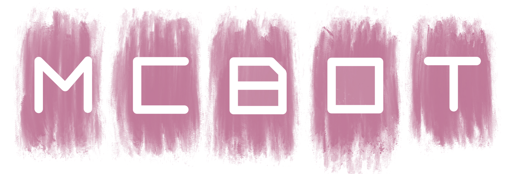

<p align="center">
    
</p>
<h1 align="center">Welcome to Discord Js MCBOT 👋</h1>
<p align="center">
  
  <a href="https://github.com/MCHDF/MCBOT#readme" target="_blank">
    
  </a>
  <a href="https://github.com/MCHDF/MCBOT/graphs/commit-activity" target="_blank">
    
  </a>
  <a href="https://github.com/MCHDF/MCBOT/blob/master/LICENSE" target="_blank">
    
  </a>
  <a href="https://img.shields.io/github/last-commit/MCHDF/MCBOT?style=flat-square" target="_blank">
    
  </a>
    <a href="https://img.shields.io/github/languages/top/MCHDF/MCBOT?color=yellow&style=flat-square" target="_blank">
    
  </a>
  <a href="https://img.shields.io/codefactor/grade/github/MCHDF/MCBOT?style=for-the-badge" target="_blank">
    
  </a>
</p>

## 주의

```
MCBOT은 모든 코드가 개인 개발 환경에 맞춰져있습니다.
이 레포는 참고용으로만 이용해주세요!
```

## Author

👤 **MCHDF**

* Website: http://mchdfpi.kro.kr
* Github: [@MCHDF](https://github.com/MCHDF)

## 설명
Discord JS로 만들어진 여러 유틸과 유머기능 등을 담은 봇입니다!

### 🖥 봇 서버 시스템 사양
흔히 보는 사양을 위주로 작성하였습니다. 
아래의 사양에서 정상적으로 가동됨을 확인하였습니다.

- 시스템 유형 : Raspberry Pi 4 Model B 🍓
  * CPU : ARM Cortex-A72 1.5GHz
  * GPU : Broadcom VideoCore VI 500MHz
  * RAM : LDDR4 4GB
  * N/W : 1Gbit Ethernet
  * Storage : External Samsung PM981a M.2 NVME SSD 256GB
  * OS : Rasbian Pi OS (Debian Base)

### 🎶 Music
[](https://github.com/MCHDF/MCMusic)

## 📜 봇 명령어

- 기본적인 명령어는 ``!help`` 명령어를 통해 확인 할 수 있습니다!
- 봇이 포함된 서버마다 접두사가 다를 경우, ``MCprefix``를 쳐서 확인하실 수 있습니다.
- 접두사를 커스터마이징하실 경우, 관리자 권한을 가지고있으셔야합니다!
```
!prefix <바꿀 접두사>
!prefix 초기화
```
더 자세한 정보는 아래의 링크를 이용해주세요!
- [Notion](https://www.notion.so/MCBOT-4105c7e176a1424fbd1398fea7d084e8) (아직 완성되지 않았어요! 내용이 부족하더라도 이해해주세요....!)
- 봇 초대 : [Here!](https://discord.com/oauth2/authorize?client_id=706171196701540384&scope=bot)

## ✨ Star!

제 레포지토리가 도움이 되셨다면 ⭐️ 을 눌러주세요!

## 📝 License

Copyright © 2020 [MCHDF](https://github.com/MCHDF).<br />
This project is [MIT](https://github.com/MCHDF/MCBOT/blob/master/LICENSE) licensed.

## 🎮 Minecraft!

코드 일부에는 카운터온라인에 대한 예외처리가 되어있습니다.<br />

<a href="https://minelist.kr/servers/8223"></a>